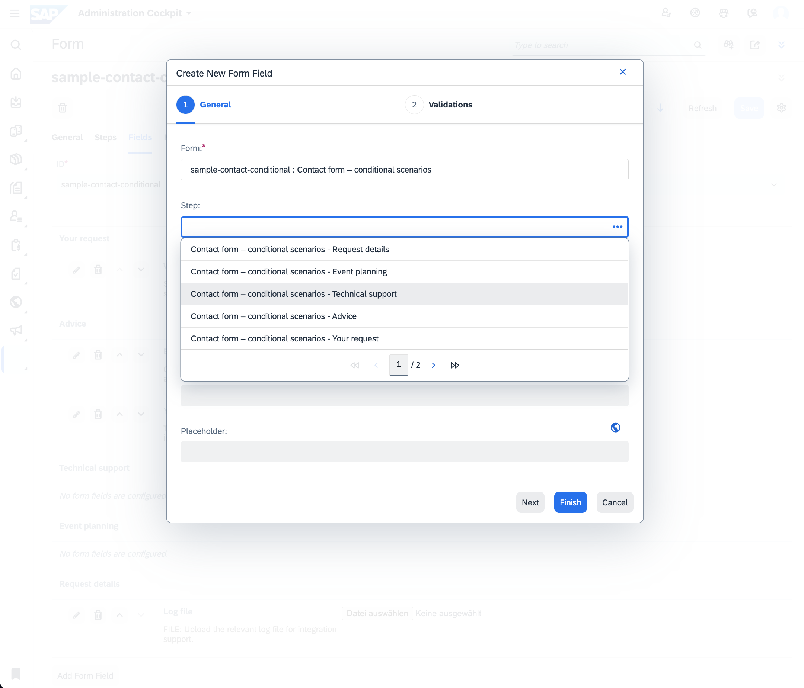
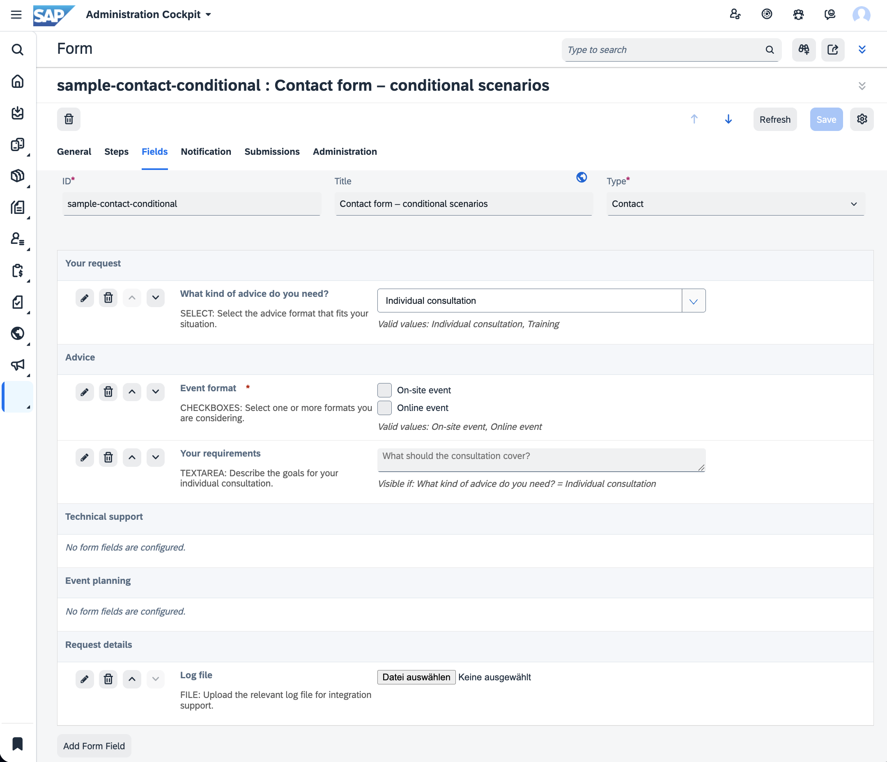

# CX DEV Forms

`cxdevforms` provides configurable form definitions, Backoffice administration
(including an interactive, WYSIWYG-style form preview), services, a facade and
an OCC API in a single SAP Commerce extension. Frontends retrieve a form by
its ID and use its field definitions, step grouping, validation metadata and
conditional child fields to build the user interface.

Java package: `me.cxdev.commerce.forms`.

## Features

- Manage forms, steps, fields, selectable values and form/field types in Backoffice.
- **Preview a form's rendered layout live in Backoffice** while editing it, including
  drag-and-drop reordering, inline create/edit/delete and step management — see
  [Interactive form preview](#interactive-form-preview).
- Group fields into ordered, localized steps for multi-page forms.
- Localize form titles, descriptions, field labels, placeholders, step labels and
  option labels.
- Configure field order, input types, defaults, visibility and validation metadata.
- Associate selectable values with conditional child fields, including nested dependencies.
- Retrieve all form definitions or a single definition by ID through services and OCC.
- Select response properties through OCC BASIC, DEFAULT, FULL or custom field sets.
- Use German and English Backoffice labels and type localization.

## Installation

The extension requires `cxdevtoolkit`, `cxdevbackoffice` and
`commercewebservices`, as declared in [extensioninfo.xml](extensioninfo.xml).

Add the extension to `localextensions.xml`:

```xml
<extension dir="${HYBRIS_BIN_DIR}/custom/cxdevtools/cxdevforms"/>
```

Build with `ant all` using the JDK and Ant environment required by your Commerce
installation, then perform a System Update for `cxdevforms`. Create form types
and definitions in Backoffice or through ImpEx.

The global Spring context is configured in [project.properties](project.properties):

```properties
cxdevforms.application-context=cxdevforms-spring.xml
```

OCC loads the web context from
`resources/occ/v2/cxdevformsocc/web/spring/cxdevforms-web-spring.xml` through the
standard `classpath*:/occ/v2/*occ/web/spring/*-web-spring.xml` resource pattern.

## Data model

The `DynamicForms` type group contains five item types, supported by two enums
and six relations.

| Type | Configuration |
| --- | --- |
| `DynamicForm` | Unique ID, localized title and description, form type, recipients, dynamic-recipient flag, ordered steps and ordered fields |
| `DynamicFormStep` | Form-owned, ordered, localized label; groups fields into a page/section of the rendered form |
| `DynamicFormField` | Unique ID, localized label, description and placeholder, input type, active/hidden/required flags, constraints, default value, optional step and selectable values |
| `DynamicFormFieldValue` | Field-owned, prefixed ID, localized label and conditional child fields |
| `DynamicFormSubmission` | Persisted answers, definition snapshot and submission metadata (see [Form submissions](#form-submissions)) |

IDs are globally unique within each item type. A field value ID is automatically
prefixed with its owning field ID. Definitions are independent of
catalog versions. `DynamicFormType` is a dynamic enum for business categories
such as `CONTACT`; additional categories can be configured in Backoffice.
`DynamicFormFieldType` defines the supported input types.

### Deployment

| Type | Table | Typecode |
| --- | --- | --- |
| DynamicForm | cxdevformsform | 31175 |
| DynamicFormField | cxdevformsfield | 31176 |
| DynamicFormFieldValue | cxdevformsfieldvalue | 31177 |
| DynamicFormSubmission | cxdevformsubmission | 31179 |
| DynamicFormStep | cxdevformsstep | 31180 |

### Field configuration

Supported field types:

`TEXT`, `EMAIL`, `HIDDEN`, `PASSWORD`, `COLOR`, `TEXTAREA`, `NUMBER`, `RADIO`,
`CHECKBOX`, `CHECKBOXES`, `SELECT`, `FILE`, `DATE`, `WEEK`.

| Property | Purpose |
| --- | --- |
| `active` | Controls inclusion of a form's top-level field; defaults to `true` |
| `hidden` | Supplies visibility metadata to the frontend; defaults to `false` |
| `required` | Marks a field as mandatory; defaults to `false` |
| `fieldType` | Selects the input type; defaults to `TEXT` |
| `minValue`, `maxValue` | Numeric validation bounds |
| `minLength`, `maxLength` | Text-length validation bounds |
| `defaultValue` | Initial value; for option-based inputs, use the selectable value's ID |
| `placeholder` | Localized input hint |
| `step` | Optional `DynamicFormStep` grouping the field in the rendered layout and in submission answers; must belong to the field's own form |
| `formFieldValues` | Ordered list of selectable values |

The frontend applies these rendering and validation settings. `recipients` and
`dynamicRecipient` describe recipient configuration; submission notifications can use the optional listener described below. The default
listener uses only configured recipients; client-supplied email routing is not supported.

### Relationships and conditional fields

`DynamicForm2DynamicFormFields` associates a form with its ordered `formFields`.
A field can belong to one form through its `form` reference.

`DynamicForm2DynamicFormSteps` associates a form with its ordered, localized
`steps`. `DynamicFormStep2DynamicFormFields` lets a field optionally reference
one of these steps through its `step` property, grouping the field with the
other fields of the same step in the rendered layout, in the interactive
Backoffice preview and in submission answer views. A step's `form` must equal
the referencing field's own `form`; Backoffice restricts the step picker to the
selected form's steps, and `DynamicFormFieldStepValidateInterceptor` rejects a
mismatching combination on save regardless of how the data was submitted.

`DynamicFormField2DynamicFormFieldValues` makes every selectable value an
ordered, part-of value of exactly one field (`field` / `formFieldValues`).
Deleting the field therefore also deletes its values.

`DynamicFormFieldValues2DynamicFormFields` connects a selectable value to its
ordered `childFields`. A child has at most one optional `parentFieldValue`, so it
is either a root field or belongs to precisely one selected value.

A frontend uses the selected option's ID to determine which child fields to
activate. Child fields can themselves contain options and further child fields,
allowing nested conditional sections. Configure these dependencies without cycles.
The form structure consists of steps, fields and conditional child fields; the
renderer controls their presentation and navigation.

## Backoffice administration

Navigate to **CX DEV Tools → Forms**:

- **Form definitions**: forms, steps, fields and selectable values.
- **Configuration**: form types and field types.

Backoffice provides search, list views, editors and creation wizards for managing
definitions and their relationships. Every wizard pre-fills technical, non-editable
identifiers automatically:

- `DynamicFormField`, `DynamicFormStep` and `DynamicFormFieldValue` each get a
  random UUID assigned to their `id` when the wizard opens; the `id` field itself
  is hidden from the wizard since it is not meant to be chosen by an editor.
- The `DynamicFormFieldValue` wizard pre-selects `field` automatically when opened
  from the **Selectable values** list of a field's own editor.
- The `DynamicFormField` wizard and editor restrict the **Step** picker to steps
  that belong to the currently selected **Form**, using the standard reference
  editor's `referenceSearchCondition_form` parameter; no step is selectable while
  no form is chosen.
- The `DynamicFormFieldType` and `DynamicFormType` wizards only show **Identifier**
  (`code`), **Localized name** (`name`) and **Icon** (`icon`, inherited from the
  base `EnumerationValue` type) — every other, less relevant field is hidden.



Typical workflow:

1. Create a form type with a business code such as `CONTACT`.
2. Create a form with a unique ID, type and localized title.
3. Optionally create one or more steps on the **Steps** tab to group the form into
   pages/sections; steps are ordered and localized.
4. Create fields with unique IDs, labels, input types and validation settings, and
   assign each field to a step if the form uses steps.
5. Assign top-level fields to the form and arrange their order — most conveniently
   through the [interactive form preview](#interactive-form-preview) described below.
6. Create selectable values and add them to each relevant field's ordered value list.
7. Assign conditional child fields to the values that activate them. Fields that
   should appear only conditionally should be configured as child fields rather
   than also being assigned as top-level fields.

List views use a custom cell renderer (`cxDynamicFormReferenceListCellRenderer`) so
that the **Form**/**Field** reference columns of the `DynamicFormField` and
`DynamicFormFieldValue` list views show the referenced item's title/label (falling
back to its technical ID) instead of a raw object reference.

### Interactive form preview

The **Fields** tab of a `DynamicForm` editor renders a custom section
(`cxDynamicFormPreviewRenderer`, backed by `DynamicFormPreviewRenderer.java`) that
gives editors an immediate, structural preview of how the configured form will be
laid out — without leaving Backoffice, publishing anything, or writing a single
line of frontend code to check the result.



For every field, the preview shows:

- Its label, a `*` marker when `required`, and a `(Hidden)` marker when `hidden`.
- Its description, if configured.
- An approximation of the real input control for its `fieldType` (text box,
  textarea, number field, date/week picker, checkboxes/radio buttons, a native
  `<select>`, a color/file input, and so on).
- Inline annotations for configured validation (length/value ranges, valid
  options, maximum file size, configured default value) and, for a conditionally
  visible field, a "Visible if: `<field>` = `<value>`" rule.

Fields are grouped under a heading for each `DynamicFormStep` configured on the
form, in the form's step order; fields without a step are shown first, ungrouped.
**Every configured step is always rendered**, even before it has any fields — an
empty step shows a placeholder row instead of disappearing, so editors always see
that the step exists and can add or drag fields into it.

Conditional fields are previewed too: a selectable value that matches the parent
field's currently configured default value is treated as "selected" for preview
purposes, and its child fields are shown nested underneath it — recursively, for
nested conditional sections — exactly as a visitor would first see them rendered.

**Actions available directly from the preview:**

| Action | Effect |
| --- | --- |
| **Add Form Field** button | Opens the standard field creation wizard, pre-bound to this form |
| Pencil icon | Opens the field's standard Backoffice editor dialog |
| Delete icon | Runs the standard Backoffice delete action and its confirmation dialog, then refreshes the preview in place |
| Up/down arrow buttons | Moves the field one position, including fields only visible via a parent selectable value |
| Drag-and-drop | Reorders a field by dragging its row to a new position, including across step boundaries or onto an empty step's placeholder row |

All of these controls are permission-aware: a button is disabled whenever the
current user lacks the corresponding create/change/delete right on the form or
the field.

Reordering fields across steps is intentionally two-staged so a single move never
does two things at once:

- Moving (via the arrow buttons) a field past the boundary into a neighboring step
  first only re-assigns it to that step, keeping its relative position; a further
  move in the same direction then reorders it within the new step.
- Dragging a field directly onto another field's row immediately repositions it
  there **and** reassigns its step in one step.
- Dragging a field onto an empty step's placeholder row assigns it into that step.

After creating or editing a field through the wizard or the standard editor
dialog, a hidden helper widget (`cxdevformsPreviewRefreshAdapter`, backed by
`DynamicFormPreviewRefreshController.java`) automatically refreshes the open form
editor so the preview reflects the change immediately — there is no need to close
and reopen the form.

The preview is a structural/visual mockup, not a functional runtime form: it does
not execute real client-side validation or accept file uploads, and conditional
visibility is approximated from the configured default value rather than fully
simulating frontend runtime behavior.

## Services and Spring configuration

| Bean / alias | Purpose |
| --- | --- |
| `cxDynamicFormService` / `dynamicFormService` | Retrieve all form models or find a model by ID |
| `cxDynamicFormFacade` / `dynamicFormFacade` | Convert form models to `DynamicFormData` |
| `cxDynamicFormDataConverter` | Convert form metadata and active top-level fields |
| `cxDynamicFormFieldConverter` | Convert field metadata, step reference and selectable values |
| `cxDynamicFormFieldValueConverter` | Convert selectable values and nested child fields |

`DynamicFormService.getAllDynamicForms()` returns an immutable copy of the model
list. `getDynamicFormForId(id)` returns an `Optional<DynamicFormModel>`.
The facade exposes the corresponding data objects.

The field and value converters resolve their mutual references through
`ObjectFactoryCreatingFactoryBean`. Populators are located in
`me.cxdev.commerce.forms.facade.populator`.

Three data classes in `me.cxdev.commerce.forms.data` and three corresponding
DTOs in `me.cxdev.commerce.forms.dto` are generated from
[resources/cxdevforms-beans.xml](resources/cxdevforms-beans.xml).

## OCC API

Controller: `me.cxdev.commerce.forms.controller.CxDynamicFormsController`.
Swagger tag: **Dynamic Forms**.

| Request | Response |
| --- | --- |
| `GET /occ/v2/{baseSiteId}/forms` | Array of all form definitions |
| `GET /occ/v2/{baseSiteId}/forms/{id}` | One form definition identified by ID |

Both endpoints accept the optional `fields` parameter, defaulting to `DEFAULT`.

| Field set | Form response |
| --- | --- |
| `BASIC` | `id`, `type`, `title`, `description` |
| `DEFAULT` | BASIC properties plus `recipients`, `dynamicRecipient` and `formFields(DEFAULT)` |
| `FULL` | DEFAULT properties with `formFields(FULL)` |

Field responses include input metadata, the owning step's `stepId`/`stepTitle`
(both `null` for a field without a step) and selectable values. Each value can
include `childFields`, producing the nested definition structure. Custom OCC
field selections are passed to `DataMapper`. Platform field-set size and recursion
limits apply to nested responses.

The mapping configuration is located in
`resources/occ/v2/cxdevformsocc/web/spring/config/`:

- `cxdevforms-dto-mappings-spring.xml`: data-to-DTO class mappings.
- `cxdevforms-dto-level-mappings-spring.xml`: BASIC, DEFAULT and FULL field sets.

### Frontend usage

```javascript
const response = await fetch(
  `/occ/v2/${encodeURIComponent(baseSiteId)}/forms/${encodeURIComponent(formId)}?fields=DEFAULT&lang=en`
);
if (!response.ok) throw new Error(`Unable to load form: ${response.status}`);

const form = await response.json();
if (!form.id) throw new Error('Form not found');
```

Render `form.formFields` using each field's `fieldType`, labels, defaults and
constraints; group fields by `stepId`/`stepTitle` if the form uses steps. Populate
choice inputs from `field.formFieldValues`. When a selection changes, evaluate the
selected value's `childFields` and update the active input controls. The
consuming frontend submits ID-keyed answers to the submission endpoint below.

### Response behavior

- An unknown form ID produces an empty data object and an HTTP 200 response with
  an unpopulated DTO. Null-property serialization follows the OCC configuration.
- Form lookup is global. The service does not filter definitions by `baseSiteId`;
  the list response is unpaginated and has no guaranteed ordering.
- Only active top-level fields are included. Nested child fields are converted
  independently of their `active` flag.
- `hidden` is returned as metadata; hidden fields remain part of the definition.
- Field data and DTOs contain a `value` property, which the definition populators
  leave unset.
- Localization and access control follow the installed OCC configuration.


## Form submissions

`CxDynamicFormsSubmissionsController` accepts
`POST /occ/v2/{baseSiteId}/forms/{id}/submissions?lang=de`:

```json
{
  "answers": {
    "name": "Ada Lovelace",
    "reason": "technical",
    "serial": "ABC-123",
    "consent": true,
    "products": ["product-a", "product-b"],
    "quantity": "2.5"
  }
}
```

Use field IDs as keys and option IDs as values. TEXT/EMAIL/HIDDEN/TEXTAREA/COLOR,
DATE/WEEK, SELECT/RADIO and NUMBER use strings (decimal point for NUMBER).
CHECKBOX uses a JSON boolean; CHECKBOXES uses an array of distinct option IDs.
Missing/null and blank text mean unanswered; required CHECKBOX must be `true`.
Zero is a valid number. Constraints count Unicode codepoints and use decimal arithmetic.
Active hidden fields remain subject to validation. Only selected options activate
conditional child fields; unknown, inactive and unselected fields are rejected.
No implicit defaults are inserted by the submission service.

The controller delegates to `dynamicFormSubmissionFacade`. The facade validates
against the stored definition and delegates valid answers to
`dynamicFormSubmissionService`; it throws `SubmissionValidationException` containing
standard Spring `Errors` on failure. HTTP responses:

- `201 CREATED`: `{ "submissionId": "UUID", "formId": "contact", "submittedAt": ... }` after commit.
- `422 Unprocessable Entity`: localized `errors` with stable `code`, `field`
  (for example `answers[email]`) and `message`; no rejected values are reflected.
- `400 Bad Request`: unreadable JSON; `404 Not Found`: unknown form ID.

Language uses the OCC-resolved session language, including `lang`. Definitions
remain global as in the existing GET API; base site is recorded from server context.
OCC authentication/access control remains platform-owned. There is no public
submission GET endpoint. Configure Backoffice type permissions for authorized
service staff. No new broad permissions are granted by this extension.

`DynamicFormSubmission` stores answers as JSON, a definition/translation snapshot,
server time, current user (including the platform anonymous user), current base site,
resolved language, bounded User-Agent and servlet remote address. Forwarded headers
are not trusted by this controller. Apply project retention and proxy policies in
integration. The form relation is not part-of: deleting a definition must not silently
cascade to historical submissions. Do not delete definitions referenced by submissions.

PASSWORD answers are rejected to avoid durable plaintext secrets. FILE accepts a
list of references only when a project replaces `cxDynamicFormSubmissionFileValidator`
with a `SubmissionFileValidator` checking ownership, allowed type/size and scan status.
The supplied validator rejects every file reference. This extension provides no upload API.
Requests allow at most 1000 fields, text values at most 65536 codepoints and conditional
depth at most 64; configure HTTP request size/rate limits at the OCC edge as well.

### Backoffice answers

Navigate to **CX DEV Tools → Forms → Submissions** (German: **Anfragen**), or open
`submissions` on a form. Filter by form, time, user or site. The read-only editor's
Answers tab (`cxDynamicFormSubmissionRenderer`, backed by
`DynamicFormSubmissionRenderer.java`) renders snapshot labels and translated option
values as plain, escaped text, grouped into a box per `DynamicFormStep` recorded in
the answer snapshot — the same step grouping used by the [interactive form
preview](#interactive-form-preview). Fields that were not assigned to a step at
submission time appear in a general answer section. Metadata and raw JSON have
separate tabs; authorization still requires platform type permissions.

Answer snapshots use the step UUID and title to preserve sections across later
definition edits, so a step renamed or removed afterwards does not corrupt older
submissions. The definition API exposes the corresponding `stepId`/`stepTitle`
representation described in [OCC API](#occ-api). Localization falls back from
requested locale to language, submitted language, English, then technical ID.

### Events and optional email notifications

`DynamicFormSubmissionCreatedEvent` implements `ClusterAwareEvent` and
`TransactionAwareEvent`. The service publishes after saving inside a Commerce
transaction; `publishOnCommitOnly()` prevents delivery for rolled-back transactions.
The event references the submission PK/UUID, form ID and originating cluster node;
it carries no answer data. Project listeners can extend `AbstractEventListener`
and load the committed submission via `ModelService`.

The prepared `DynamicFormSubmissionEmailListener` is **not registered by default**.
To enable it, import this resource in project Spring configuration:

```xml
<import resource="classpath:cxdevforms/cxdevforms-submission-email-spring.xml"/>
```

The listener uses `htmlEmailGenerator` and `htmlEmailService` from `cxdevtoolkit`.
Only the originating node sends mail, avoiding a notification per cluster node.
It reads the form's configured `recipients`; `dynamicRecipient` does not enable
arbitrary client email addresses. Missing recipients skip mail. Exceptions are logged
without template or answer content and do not reverse successful persistence.
This prepared listener is best-effort: the Commerce cluster event bus and SMTP do
not guarantee durable or exactly-once delivery. Projects requiring retry/failover
should persist an outbox and implement idempotent listeners rather than retry POSTs.
The current Commerce POST has no idempotency key; each successful POST creates a submission.

Administrators may set localized `DynamicForm.submissionEmailTemplate` to trusted
Thymeleaf HTML. The listener requests the submission locale (Commerce's configured
localized-attribute fallback applies); a blank template uses
`email-templates/html/cxdevforms-submission.html`. Invalid nonblank templates fail
notification and are not silently replaced. Context variables:

| Variable | Contents |
| --- | --- |
| `submission` | Persisted model and metadata |
| `answers` | Entire typed answer map, keyed by field ID |
| `answersJson` | Entire JSON string |
| `view` | Localized title and ordered sections, each with label/value answer rows |

The fallback renders every effective field using `th:text`. Treat templates as
trusted administrator code and submitted answers as text, never as executable
Thymeleaf or unescaped HTML.

### Upgrade and validation

Run `ant all`, then a System Update for `cxdevforms` to create/update the item
types above (including `DynamicFormStep`, typecode 31180) and their attributes and
relations. Existing definitions need no data migration; step grouping and
per-form email templates are optional.

Unit tests cover conditional validation, HTTP contracts/localization, persistence
failure handling, snapshots/presentation and optional email behavior. The service-layer
integration test requires an initialized Commerce test tenant with this type system.
SAP's transaction-aware event contract is documented in
[TransactionAwareEvent](https://help.sap.com/doc/02d5152884b34821a06408495ba0b771/1905/en-US/de/hybris/platform/servicelayer/event/TransactionAwareEvent.html).
